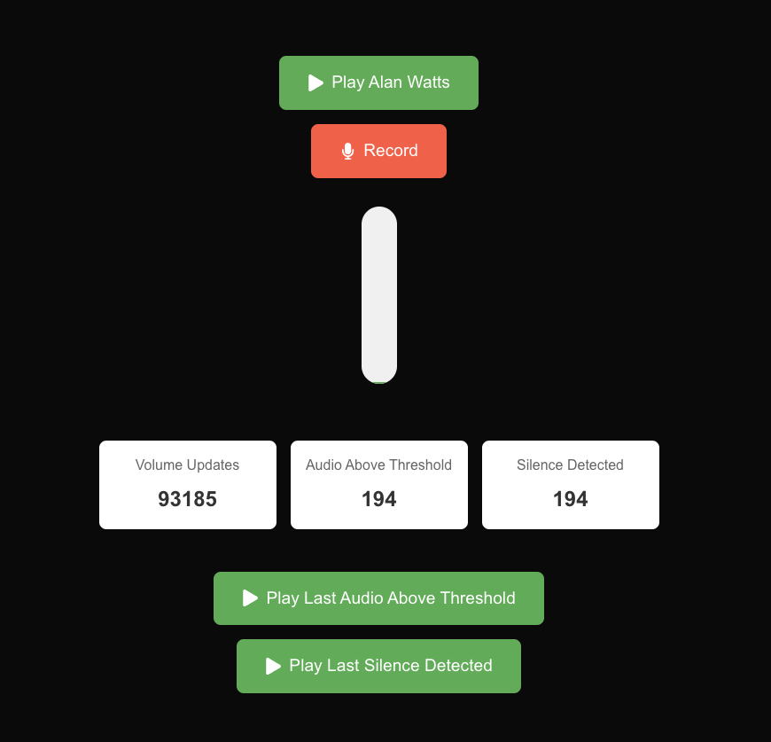

# Voice Interaction Audio 
This is a proof of concept project that proves out how to handle voice commands from a user, when both speech to text and text to speech are being used during voice interactions with an LLM.

## Demo
An Alan Watts lecture is used to play the part of the assitant speaking.  When the user speaks, Alan Watts is paused until silence is detected.


# Modules

## AudioLoudnessMeter.ts
When activated, constantly records audio from the user's mic, and monitors volume to see when it exceeds a given threshold.

### Callbacks
#### onAudioAboveThresholdDetected
When the volume threshold is crossed, a second of audio data (audio/webp) is provided to this callback.

This audio data should be sent to a speech to text service, to determine if the AI assistant's name has been mentioned.

#### onSilenceDetected
When the volume threshold is crossed, and then a period of silence is detected (default 1 second), the complete audio between when the volume threshold was crossed, and when silence was detected, is sent to this callback.

This audio data should be sent to a speech to text service, to then translate the speech to text and send the text to an LLM, if you have verified that the assistant's name has been mentioned (or perhaps some other condition you deem viable).


## QueuedWebAudioPlayer.ts
This service allows stacking multiple blobs of audio to be played one after another, which is useful when performing speech to text for multiple sentences.

e.g. The LLM has responded with 4 sentences, and each sentence text is sent to a text to speech service, which provides 4 blobs of audio to be played.

## Voice Interaction Audio Service
This service wraps both the QueuedWebAudioPlayer and AudioLoudnessMeter, and pauses any audio being played (ie the assistant speaking) when the user speaks into the mic.  This helps ensure that the assistant and the user aren't speaking at the same time, which improves the quality of audio captured for speech to text.

# Setup
## npm install
```
npm install
```

## Running
```bash
npm run dev
```

